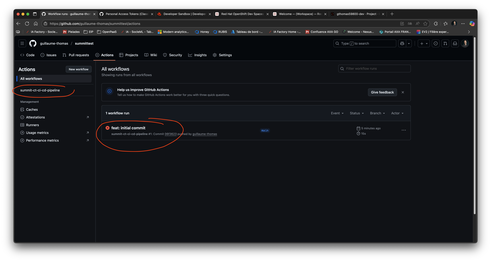
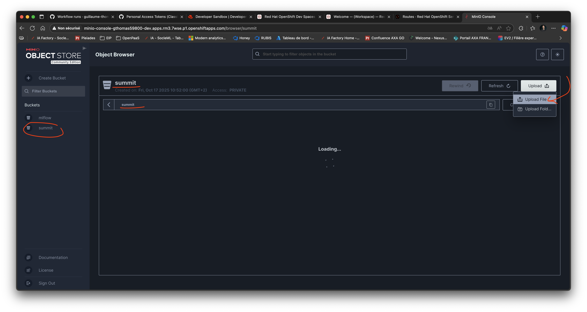
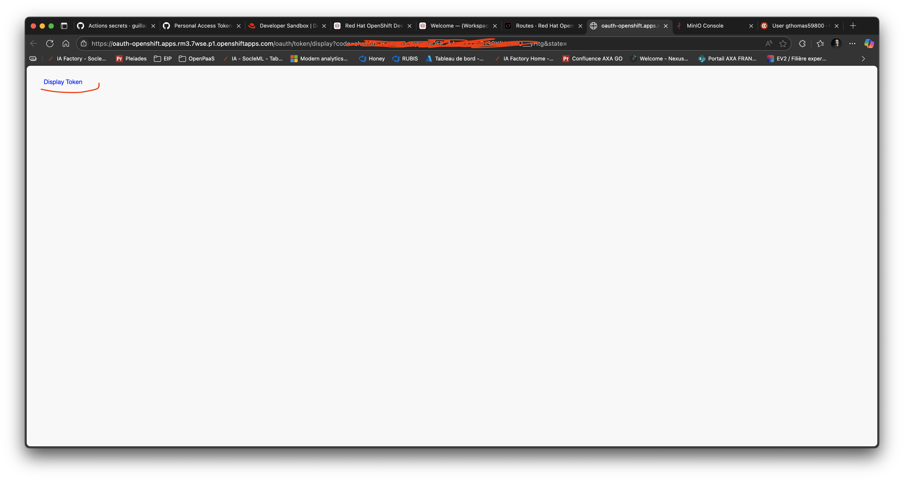

# summit-mlops-2025

This project allows you to create a new MLOps project with a standard structure, using Cookiecutter and uv.
It allows you also to deploy a simple mlflow server with a backend and a file store in free RedHat Openshift Sandbox.

Here's how to get started!

## Prerequisites
- Create a Github account if you don't have one.
- Create a new public repository in your Github account. Keep it empty for now and note your repository name.


- Create an account on [Developers RedHat](https://developers.redhat.com/) if you do not have one.
- Start your free RedHat Sandbox [here](https://sandbox.redhat.com). It will last 30 days and you can renew it.

- First, open Openshift Web Console from your RedHat Sandbox and note your sandbox name.


- Create a new empty Workspace in RedHat Openshift DevSpaces. This will take a few minutes. This workspace has python 3.11, oc client, kubectl client and podman installed.


- First install uv and cookiecutter in your RedHat DevSpaces workspace. To do so, open a terminal in your DevSpaces and run:
```bash
pip install uv cookiecutter
```


- Then, create a new MLOps project with cookiecutter. You will need to create a new Personal Access Token in your Github account with repo and worklow rights to be able to push your project to your new repository.


- Then run the following command in your RedHat DevSpaces terminal. You will be prompted to answer a few questions about your new project.
```bash
cookiecutter https://github.com/guillaume-thomas/summit-mlops-2025
```

- First, when asked for the project name, enter the name of your new empty repository in your Github account (noted above).
- Then, enter a valid python package name (no dash, no space, only letters, numbers and underscores, starting with a letter or an underscore). Should be "summit". MUST NOT BE THE SAME AS YOUR REPOSITORY NAME.
- Then, enter your RedHat Sandbox name when asked. It should be the name you noted above (your namespace name, without "-dev").
- Then, enter the python version you want to use => 3.13 is recommended.
- Then, enter a short description of your project.
- Finally, enter your name

Now, you can see that a new directory with your project name has been created in your current directory. Change to this new directory:
```bash
cd <your project name>
```

You can open the project it in your Visual Studio Code in your RedHat DevSpaces.


In your terminal, sync your python environment with:
```bash 
uv sync --all-groups
```

It will create a new venv in `.venv` directory. Activate it with:
```bash
source .venv/bin/activate
```

It will also create a uv.lock file with all your dependencies.

You can now push your project to your new Github repository with:
```bash
git config --global init.defaultBranch main
```
```bash
git config --global user.email "<your_email>"
```
```bash
git config --global user.name "<your_name>"
```
Init a local git repository
```bash
git init
```
Add the remote origin pointing to your empty GitHub repository
```bash
git remote add origin https://<your_token>@github.com/<your_GITHUB_username>/<repository_name>.git
```


```bash
git add .
```
```bash
git commit -m "Initial commit from cookiecutter template"
```
```bash
git push -u origin main
```

It will start automatically a first workflow in your Github repository. It should failed.



Don't worry, it's normal. You need to set a few environment variables in your Github repository (steps below) and deploy your mlflow on openshift.

## Deploy a mlflow server in your RedHat Openshift Sandbox

In your DevSpaces terminal, run the following commands to deploy a mlflow server in your RedHat Openshift Sandbox:
```bash
chmod -R 777 scripts
./scripts/install-mlflow.sh
```

See in your Openshift Web Console that all the necessary resources (PVC, Deployment, Service, Route, ...) have been created.


Please note that the mlflow server is not secured. It is only for demo purposes.

## Add your data in minio
You can use the minio console to upload your data. To do so:
- In your Openshift Web Console, go to "Networking" > "Routes" and click on the route named `minio-console`.

- It will open the minio console in a new tab. The username is `minio` and the secret key is `minio123`.

- Create a new bucket named `summit` if it does not exist already.


- Upload your data in this bucket. Upload only the csv file `data.csv` provided in the `data` directory of your project.




## Create your quay repositories

Connect to [quay.io](https://quay.io/) with your Developer RedHat account and create two new public repositories:
- `<your_username>/summit/summit-experiment`
- `<your_username>/summit/api`


In order to be able to push your images to your quay repositories, you need to create a new robot account in your quay organization. To do so:
- Go to your quay organization (your username) and click on "Account Settings"

- Click on "Robot Accounts" in the left menu
- Click on "Create Robot Account"

- Enter a name for your robot account (e.g. `summit_bot`)

- Select "Admin" permissions for your two new repositories

- Click on "Create Robot Account"
- Note the robot account name (e.g. `summit_bot+robot`) and the token. You will need them later.


## Set your environment variables in your Github repository

It is nearly finished! You just need to set a few environment variables in your Github repository. To do so:
- Go to your Github repository and click on "Settings"

- Click on "Secrets and variables" in the left menu
- Click on "Actions"

- Click on "New repository secret" and create the following secrets:

  - `AWS_SECRET_ACCESS_KEY`: the secret key of your minio server. It is `minio123`.

  - `OPENSHIFT_TOKEN`: your RedHat Openshift Sandbox token. To get it, go to your Openshift Web Console, click on your username in the top right corner and then on "Copy Login Command". Click on "Display Token" and copy the token.



  - `QUAY_ROBOT_TOKEN`: your quay robot account token (noted above)
- Click on "Add secret" after entering each secret.

- Click on the Variables tab and then on "New repository variable"

- Create the following variables: 
  - `API_ROUTE`: the route of your api. It should be something like `https://mlops-api-<your_sandbox_name>-dev.apps.<your_sandbox_cluster:rm3.7wse.p1>.openshiftapps.com`. It should not exist yet. Do not forget httpS !!!

  - `AWS_ACCESS_KEY_ID`: the access key of your minio server. It is `minio` by default
  - `DAILYCLEAN_ROUTE`: the route of your dailyclean service. It should be something like `http://dailyclean-<your_sandbox_name>-dev.apps.<your_sandbox_cluster:rm3.7wse.p1>.openshiftapps.com`. You can find it in your Openshift Web Console under "Routes".
  - `MLFLOW_S3_ENDPOINT_URL`: the S3 (minio) endpoint URL of your mlflow server. It should be something like `http://minio-api-<your_sandbox_name>-dev.apps.<your_sandbox_cluster:rm3.7wse.p1>.openshiftapps.com`. You can find it in your Openshift Web Console under "Routes". BE WARNED ! USE minio-api NOT minio-console
  - `MLFLOW_TRACKING_URI`: the URL of your mlflow server. You can find it in your Openshift Web Console under "Routes". It should be something like `http://mlflow-<your_sandbox_name>-dev.apps.<your_sandbox_cluster:rm3.7wse.p1>.openshiftapps.com`
  - `OPENSHIFT_SERVER`: the API server of your RedHat Openshift Sandbox. You can find it in your Openshift Web Console under "Copy Login Command". It should be something like `https://api.<your_sandbox_cluster:rm3.7wse.p1>:6443`

  - `OPENSHIFT_USERNAME`: your RedHat Openshift Sandbox username. It is the same one you noted above.
  - `QUAY_ROBOT_USERNAME`: your quay robot account name (noted above)

- Now, you can re-trigger manually the workflow in your Github repository by clicking on "Actions"
- Click on the workflow name (e.g. `summit-ct-ci-cd-pipeline`)
- Click on Re-run jobs > Re-run all jobs
- You can follow the progress of the workflow in the "Actions" tab. It should build and push your images to your quay repositories and deploy the api in your RedHat Openshift Sandbox.


- Finally, test your api by calling the health endpoint. You can use curl or Bruno or even your browser. The api route is the one you set in the `API_ROUTE` variable above.
```bash
curl -X GET <your_api_route>/health
```
It should return `{"status":"ok"}`.


NOW, YOU'RE ALL SET :) ENJOY MLOPS ON REDHAT OPENSHIFT SANDBOX !!!!!!!

Do not forget to use Dailyclean to awake or asleep your mlflow server and your api to avoid sandbox resource limits.